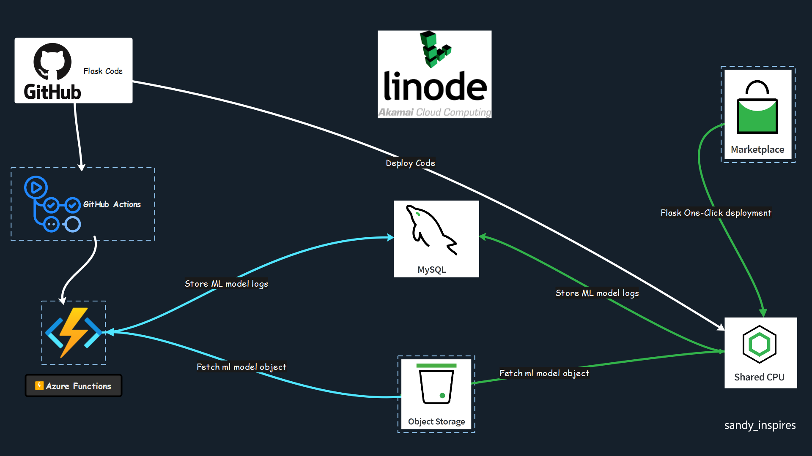

# Linode + DEV Hackathon 2023 - ML Model Consume - Sandy Inspires

This repo contains code that runs on `Linode's Shared CPU` where a binary classifier machine learning model file is placed in `Linode Object Storage`, which is consumed by a `Flask` web application written in `Python` to do prediction, log the prediction status in `Linode's MySQL server`, and return results.

Download the Postman collection which has sample API endpoints and JSON request body

Request URL - http://194.195.115.181

`NOTE: this is a http endpoint and doesn't have a domain name yet - runs on port 80`

## YouTube Demo Video 📺📺
### [Click here to watch the demo](https://www.youtube.com/watch?v=9g36_NK3kNY&ab_channel=LateNightCodewithSanthosh)


<a href="https://youtu.be/9g36_NK3kNY">
  
</a>

## Setup environment variable
#### Please set the below variables
- LINODE_OBJECT_STORAGE_ACCESS_KEY - Linode Object Storage Access Key
- LINODE_OBJECT_STORAGE_SECRET_KEY - Linode Object Storage Secret Key
- MYSQL_HOST - MySQL host name
- MYSQL_USERNAME - MySQL username
- MYSQL_PASSWORD - MySQL user password
- LATEST_MODEL_VERSION - the latest version of the model (V1, V2, etc)


## Architecture Diagram


## Http Method

### POST

#### /predict

Get the prediction for fresh water.

## Request parameters

1) `mode` (str, required)

Mode of operation, do prediction or just describe the model (predict or model_describe)

2) `features_dict` (dict. required if mode is predict) 

Input features for detection

3) `model_version` (str, optional)

Version of the model you want to use (v1, v2 or latest)<br>
Defaults to `latest`

4) `get_probability` (bool, optional)

If set to true, the request should return the probability of the classes<br>
Defaults to false

5) `get_feature_importance` (bool, optional)

If set to true, returns the importance of each feature the model was trained on<br>
Defaults to false

6) `get_model_features` (bool, optional)

If set to true, returns the feature columns the model was trained on<br>
Defaults to false

7) `skip_db_update` (bool, optional)

If set to true, skips the prediction update to db and make the response time faster

## Request headers

`Content-Type` (required) string  

Media type of the body sent to the API. (application/json)

`NOTE: it's an public API endpoint so no authentication required. Never run public public endpoints in production`

## Request Sample

Sample request body for prediction:

```
{
    "features_dict": {
        "pH": "0.916054662638588",
        "Iron": "0.61964963700558",
        "Nitrate": "0.0",
        "Chloride": "0.0",
        "Lead": "0",
        "Zinc": "0.9780321533559888",
        "Turbidity": "0.2486518821452759",
        "Fluoride": "0.6913182398790103",
        "Copper": "0.96396750718677",
        "Odor": "0.7721724045887509",
        "Sulfate": "0.81345037627716",
        "Chlorine": "0.966623674745241",
        "Manganese": "0.011527500694864",
        "Total Dissolved Solids": "0.36944624557778"
    },
    "model_version": "v1",
    "mode": "predict",
    "get_probability": true,
    "get_feature_importance": true,
    "get_model_features": true,
    "skip_db_update": false
}
```


## Response 200
The response include the extracted features in JSON format.

```
{
    "prediction": "safe to consume",
    "predicted_class": 0,
    "probability": {
        "0": 0.5384615384615384,
        "1": 0.46153846153846156
    },
    "feature_columns": [
        "pH",
        "Iron",
        "Nitrate",
        "Chloride",
        "Lead",
        "Zinc",
        "Turbidity",
        "Fluoride",
        "Copper",
        "Odor",
        "Sulfate",
        "Chlorine",
        "Manganese",
        "Total Dissolved Solids"
    ],
    "feature_importance": [
        0.1315288343051377,
        0.05904120131425621,
        0.06170211245003547,
        0.1086330101463574,
        0.005545970740731968,
        0.031131607589077844,
        0.09375709765287078,
        0.05967779427995336,
        0.08468771243873978,
        0.0849028544693462,
        0.03929514319469508,
        0.060234075439392784,
        0.1428010505057667,
        0.03706153547363892
    ],
    "response_time": 0.0127,
    "log_source": "linode"
}
```